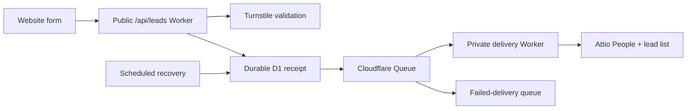

# Cloudflare → Attio lead capture

`/value-my-data` uses Cloudflare Workers, a durable D1 submission ledger, and a Queue. Website rendering and accepted submissions are independent of CRM availability. See [staging and native monitoring](staging.md).

Production also creates Data Deals for confirmed Cal bookings (**Booked**) and verified nonqualifying forms (**Not eligible - Replay form**). See [Cal → Attio setup, hidden references, and recovery](cal-attio-data-deals.md).



## Development resources

| Resource | Value |
| --- | --- |
| Attio workspace / list | Replay Sandbox / Website Leads (Dev) |
| Intake Worker | `replay-leads-intake-dev` |
| Dev API | `https://replay-leads-intake-dev.replay-marketing-dev.workers.dev/api/leads` |
| Private delivery Worker | `replay-leads-delivery-dev` |
| Main / failed queue | `replay-leads-dev` / `replay-leads-dev-failed` |
| Turnstile widget | Replay Leads Development; localhost and 127.0.0.1 only |

Local development runs at `http://localhost:3000`. Staging, production, and native health alerts are deployed; see the [staging](staging.md) and [production](production.md) runbooks.

## Local setup

Use Node 22+ and npm. Put the sandbox token in ignored `.env` as `ATTIO_API_KEY`.

```bash
npm ci
npm run attio:setup:dev
npm run dev
```

`dev` starts Next and local Workers. Queues persist under ignored `.wrangler` directories. The consumer writes to the real Attio sandbox. Official test Turnstile keys work only locally; the hosted intake refuses them.

The runner writes scoped, ignored `.dev.vars` files. Intake receives only its verification secret; delivery receives the CRM credential. IDs are pinned to the sandbox, and every delivery checks the token's actual workspace before writing. Never put secrets in `NEXT_PUBLIC_*` variables.

`npm run dev:web` starts Next alone; `npm run dev:leads` starts local Workers alone. Stop the existing Next process before switching modes.

## Real Cloudflare dev testing

Wrangler must authenticate to the account pinned in both configs. Its `workers.dev` subdomain is already configured.

```bash
npm run cloudflare:setup:dev
npm run leads:deploy:dev
npm run dev:remote
```

Setup reuses or creates queues and a real Turnstile widget, saving credentials to ignored `.env`. Deployment checks the workspace/list/schema and scopes secrets to their respective Workers. `dev:remote` uses real verification and proxies `/api/leads` to the hosted dev intake.

Use synthetic data. Chrome completed local and hosted verification. The embedded app browser reported Turnstile error 300030, a generic challenge failure whose exact cause was not established. Unavailable verification now offers the manual-review fallback described below.

## Checks and evidence

```bash
npm run test:leads
npm run typecheck
npm run leads:smoke:local
```

The smoke test requires local Workers on port 8787. It creates a labeled sandbox inquiry, verifies all answers and campaign data, resubmits its ID, and checks that there is still one entry. Synthetic records remain available for inspection.

Initial development verification on 2026-09-18 (before the fallback release; see [later release evidence](verification-fallback-validation.md)):

- Local HTTP and browser submissions reached Attio; repeated IDs produced one inquiry.
- Chrome passed real Turnstile and submitted through the deployed Queue and private consumer. [Inspect the resulting synthetic person](https://app.attio.com/replay-sandbox/person/ec45970c-6f6a-4961-8f0c-53769f3a761a).
- Hosted intake rejected dummy verification (400) and an unapproved origin (403).
- Nine automated tests, TypeScript, scoped ESLint, and an optimized Next build passed. `/value-my-data` remains prerendered. That build used the dev public widget key; production requires a new build with its own key.
- Retry/backoff behavior was tested with injected failures. A prolonged hosted outage and final DLQ transfer have not been exercised end to end.

## Security and delivery semantics

- Intake requires an allowlisted Origin, JSON, and valid fields. Verified submissions require server-side Turnstile checks of hostname/action; unavailable verification follows the stricter manual-review path below. Origin filtering is defense in depth, not authentication.
- Bodies are capped at 8 KiB. Rate limiting is configured for 10 attempts/minute/IP per Cloudflare location, with an additional 2/minute limit for unverified attempts. Cloudflare's counters are permissive and eventually consistent, so these are approximate limits rather than exact caps or a global cost cap.
- Clients cannot choose the CRM destination, source URL, or environment. Only allowlisted campaign fields are retained. IPs and verification tokens are not stored in the queue or CRM.
- The Attio secret belongs only to the consumer, which has no fetch handler, public workers.dev address, or preview URL.
- Form success means D1 durably saved the inquiry. Queue enqueue and Attio delivery are recoverable asynchronous steps. Errors preserve answers and reset verification for retry. Attempted submissions also retain their UUID and answers in tab-scoped session storage until confirmed (maximum 24 hours).
- People are matched by email. Company name and answers are saved on the inquiry. Existing CRM names/company relationships are preserved; company identity is not guessed from an email domain.
- Unique `replay_submission_id` prevents duplicate inquiries for the same submission, including concurrent delivery or a lost response after commit. New inquiries can create new entries for the same person. The browser retains the ID for unchanged answers and can restore an unconfirmed attempt after reloading the same tab.
- Transient delivery errors (408, 429, 5xx including 529, timeouts, and network failures) retry up to 12 times per queue message with exponential delay, capped at one hour and honoring Retry-After up to that cap. Exhausted messages move to the failed queue; pending D1 records remain recoverable. Other Attio 4xx responses become terminal `failed` receipts and are routed to the failed queue without automatic CRM retries. Dev queues retain messages for 24 hours. Delivered payloads are cleared after 30 days; receipt metadata remains.
- Application logs contain event names, submission/entry IDs, attempts, and status codes, not lead bodies or tokens. Invocation logs are disabled.

## Production rollout

Production is live. The following is the provisioning checklist; use the [production runbook](production.md) for current resource IDs, routes, deployment, monitoring, and rollback.

1. Choose the canonical website origin and an existing **People** list. Set production `ATTIO_WORKSPACE_ID` and `ATTIO_LIST_ID` in `workers/lead-delivery/wrangler.json`. Production must use a different workspace from the sandbox.
2. Put production credentials in ignored `.env.production.local`: `ATTIO_API_KEY`, `TURNSTILE_SECRET_KEY`, `NEXT_PUBLIC_TURNSTILE_SITE_KEY`, and `NEXT_PUBLIC_SITE_URL`. Use a separate widget restricted to production hostname(s), excluding localhost.
3. Run `npm run attio:setup:prod` to add the namespaced fields in `modules/lead-capture/lib/attio-schema.ts` to that existing list. It checks token identity before mutations. Setup needs configuration-write permissions. Afterwards use a runtime token scoped to `record_permission:read-write`, `object_configuration:read`, `list_configuration:read`, and `list_entry:read-write`; the sandbox setup token is broader.
4. Create `replay-leads-prod` and `replay-leads-prod-failed`. Set explicit retention compatible with the plan, privacy policy, and operational response time.
5. Set production `SITE_ORIGIN` and `ALLOWED_ORIGINS` in the intake config. Add an exact route such as `{ "pattern": "www.example.com/api/leads", "zone_name": "example.com" }`, replacing it with the actual proxied Cloudflare hostname/zone. Add another exact route only if another hostname serves the form. Keep workers.dev and preview URLs disabled.
6. Configure an alert destination for queue age/backlog, intake errors, repeated delivery failures, and any failed-queue message. Both staging and production now have native health alerts; production notification delivery was verified in the [launch evidence](production-validation.md).
7. Build the website with the production public widget key and canonical URL. Use the static export/image pipeline proven on staging with a separate production site Worker and configuration. Enable indexing only on the canonical production domain. Preserve metadata, sitemap, images, and careers routes.
8. Run `npm run leads:deploy:prod`. Preflight rejects missing settings, sandbox credentials, incompatible fields, test secrets, non-HTTPS origins, and missing exact API routes. Verify a synthetic production inquiry before real traffic.

The website and API require a matching Turnstile site/secret pair. Public variables are compiled into the browser bundle; updating runtime variables alone does not change the client key.

## Recovery

Inspect logs with `npx wrangler tail -c workers/lead-delivery/wrangler.json --env development`; use `production` only for production operations. Correlate by submission ID.

Fix credentials/schema/throttling/upstream availability first. Inspect the D1 status before replaying a dead letter. A `pending` receipt can be replayed to the matching main queue with its original JSON and ID. A terminal `failed` receipt must first be explicitly reopened using the procedure below; resending its message alone cannot bypass the terminal state. Acknowledge the failed-queue copy only after confirming delivery in Attio. Do not put payloads in tickets/logs or purge queues to clear alerts.

Migration `0004_terminal_failures.sql` preserves existing receipts while adding `failed` status and durable failed-queue dispatch state. The source message is acknowledged only after failed-queue acceptance is recorded. The schedule recovers interrupted failed-queue sends without calling Attio. A crash between queue acceptance and the ledger update can produce a duplicate dead letter with the same ID. Terminal payloads remain in D1 and make health unhealthy even after the failed queue expires.

After fixing the cause, reopen one terminal receipt with this SQL, replacing `SUBMISSION_UUID` with the inspected receipt ID and `production` with the matching environment when appropriate:

```sql
UPDATE lead_submissions
SET status = 'pending', failed_at = NULL,
    failed_queue_sent_at = NULL, failed_queue_lease_until = 0,
    next_dispatch_at = 0, last_failure_code = NULL
WHERE submission_id = 'SUBMISSION_UUID'
  AND environment = 'production' AND status = 'failed';
```

Execute the SQL through the target D1 console or a local SQL file passed to `npx wrangler d1 execute replay-leads-prod-ledger --remote -c workers/lead-delivery/wrangler.json --env production --file <sql-file>`. For development, use `replay-leads-dev-ledger`, `--env development`, and `environment = 'development'`. The next scheduled scan sends the original inquiry back to the main queue. Keep its ID, payload, hash, and successful unverified-email timestamp unchanged; confirm `delivered` before acknowledging the old dead letter.

Queue retention is finite; the D1 ledger preserves pending submissions beyond it. Monitoring and timely recovery remain necessary. Production uses a separate D1 database, migrations, a recovery schedule, and queue bindings. Deployment refuses to proceed without the ledger and recovery bindings.

Platform references: [Turnstile validation](https://developers.cloudflare.com/turnstile/get-started/server-side-validation/), [test keys](https://developers.cloudflare.com/turnstile/troubleshooting/testing/), [Queue retries](https://developers.cloudflare.com/queues/configuration/batching-retries/), [dead-letter queues](https://developers.cloudflare.com/queues/configuration/dead-letter-queues/).

## Verification fallback and first-touch attribution

The form captures campaign tags and the first landing pathname across navigation after marketing consent. This is tab-scoped, expires after 24 hours, and omits unrelated query parameters and fragments. Storage restrictions fall back to memory for client navigation. Attio's existing `replay_campaign` JSON contains the allowlisted UTM fields and a `landing_page` URL whose origin is supplied by the server. `replay_source_url` remains the form page. Consent withdrawal clears browser attribution; an already accepted receipt keeps its original server-side record.

If Turnstile cannot load, errors, or remains unresolved for 15 seconds, the form offers **Send for review**. The server can also accept a verification-service outage for review. An explicit failed server verification or wrong hostname/action still rejects the request. All requests retain origin, body-size, field validation, and the configured 10-attempt/minute/IP/Cloudflare-location limit. Unverified attempts have an additional limit of 2/minute/IP/location. These counters are permissive and eventually consistent: rapid bursts can briefly exceed the configured limit before returning 429. They are local edge limits, not a global distributed-bot cap; a client-reported widget failure is not proof of human activity. See [Cloudflare rate-limit semantics](https://developers.cloudflare.com/workers/runtime-apis/bindings/rate-limit/).

The server sets `verification` on the durable receipt. Attio exposes **Verification status** (`Verified`, `Unverified`, or `Unknown (legacy)`) and **Verification detail**. Older receipts lacking verification evidence remain unknown; the intake also reports `unknown` when replaying such a receipt. Unverified inquiries are for manual review, not automatically qualified leads. The consumer sends an alert to `jono@sunsethq.com` from `leads@notifications.replay.ai` before CRM delivery; development alerts include `[TEST]`. Cloudflare Email Sending is configured on the dedicated `notifications.replay.ai` subdomain, with recipient and sender restrictions on the Worker binding. Existing inbound mail routing is unaffected.

## Calendar qualification

After durable acceptance, the intake response includes `bookingUrl` only when the saved inquiry is verified, the business has **10 or more people**, and **at least 80%** of its internal communications are in English. Years of operation do not affect qualification. All valid inquiries continue through the same Attio delivery pipeline, whether they qualify for booking or not.

Configure `CAL_BOOKING_URL` in the intake/site Worker's environment variables with a public event URL on `https://replaydata.cal.com` (not the `app.cal.com` event management URL). Until an event is configured, `bookingUrl` is `null`. Unverified inquiries also receive `null`, including retries that acquire verification after the original unverified receipt. The website loads the calendar only after an accepted response with a booking URL, prefills the submitted email, and provides a direct link if the embed is unavailable. Other accepted inquiries see “Thank you for your interest. We’ll reach out if it’s a fit.”

The production and staging site configs use [Sales — Data valuation call](https://replaydata.cal.com/sales/data-valuation), managed in [Cal event 7202505](https://app.cal.com/event-types/7202505). It is a 30-minute Cal Video event with round-robin assignment to Brendan Mahony or Jackie (`jackie@replay.ai`), maximizing availability. Jono is excluded from the event. A common Working hours schedule limits availability to Monday–Friday, 9am–5pm America/New_York. Jackie was invited to Sales after approval of Cal's additional $37/month seat. The public page and local embed were checked for available slots without creating a booking. Use the same URL as `REPLAY_PREVIEW_CAL_URL` for local preview; the production form picks up this configuration when the PR is deployed.

This flow writes the original answers to **Replay Website Leads**; it does not create a `data_deals` record or save a calendar booking outcome. Calendar qualification and booking are separate from Attio delivery.

Email notification leases and successful-send timestamps live in D1 migration `0003_unverified_notifications.sql`. Failed email sends retry through the existing queue and durable recovery path; they also keep delivery health unhealthy once pending exceeds five minutes. A successful send is skipped on subsequent attempts. Delivery is at least once: a crash between the provider accepting an email and the D1 receipt can produce a duplicate email with the same submission ID. No form answers, emails, or campaign values are written to application logs.

Retries keep the same UUID when only consent, attribution, or verification changes. Different business answers get a new ID. The ledger preserves the original accepted payload and supports receipt hashes from the previous release.

Run `npx tsx scripts/smoke-unverified.mts development` (or explicitly `production`) to create one synthetic inquiry, send a real operator alert, verify duplicate handling and the tighter limit, and check its Attio label/attribution. Setup order: provision the email sender and destination, run Attio setup for the target, apply migrations/deploy the consumer, then deploy the site. `UNVERIFIED_LEADS_ENABLED` can disable fallback while leaving verified submission available. Both deployment scripts run all `tests/*.test.ts` plus TypeScript before publishing.

## Automated browser gate

See [signup browser tests](signup-browser-tests.md) for the secret-free CI journey, simulated dependencies, and separately verified hosted sandbox smoke.
